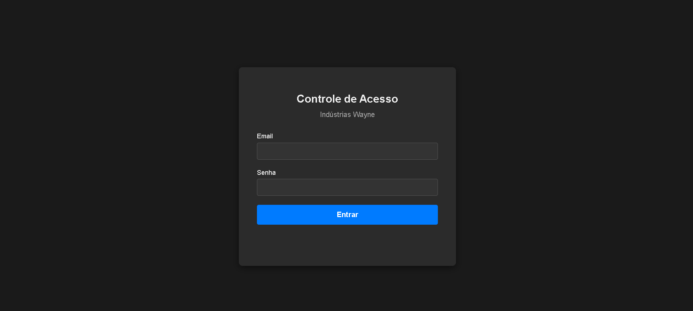
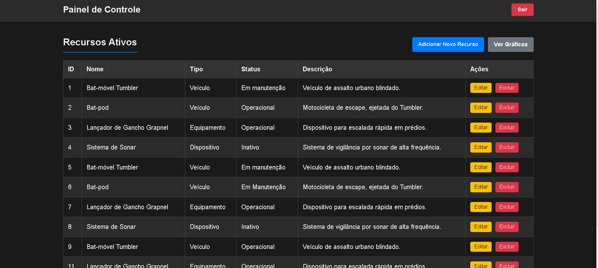
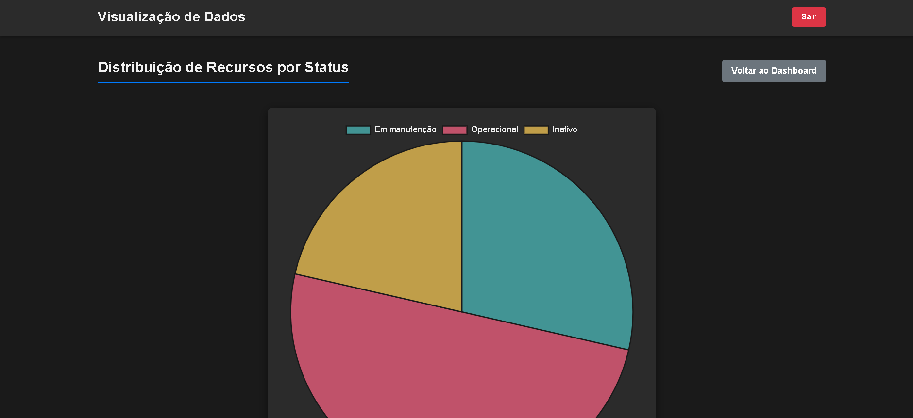

# Sistema de Gerenciamento de Segurança - Wayne Enterprises

Este é um projeto full stack que simula um sistema de controle de acesso e gerenciamento de recursos para as Indústrias Wayne. A aplicação foi construída do zero, implementando um back-end seguro em Python/Flask e um front-end interativo em JavaScript puro.

O sistema permite que usuários com diferentes níveis de permissão (ex: 'Funcionário', 'Gerente', 'Administrador') façam login, gerenciem um inventário de recursos e visualizem estatísticas sobre o sistema.

## Demonstração (Screenshots)





## Funcionalidades Implementadas

* **Autenticação Segura:** Sistema de login com senhas criptografadas (Bcrypt) e autenticação baseada em Tokens (JWT).
* **Controle de Acesso por Nível:** O sistema diferencia o que 'Funcionários', 'Gerentes' e 'Administradores' podem fazer (Autorização).
* **Gerenciamento de Recursos (CRUD Completo):**
    * **Criar (Create):** Adicionar novos recursos através de um formulário em modal.
    * **Ler (Read):** Listar todos os recursos numa tabela.
    * **Atualizar (Update):** Editar recursos existentes (com o modal pré-preenchido).
    * **Deletar (Delete):** Remover recursos com um modal de confirmação customizado.
* **Dashboard de Visualização:** Uma página dedicada (`/graficos.html`) que exibe um gráfico de pizza (usando Chart.js) com as estatísticas de status dos recursos, consumindo um endpoint de estatísticas da API.
* **Interface de Usuário (UI) Polida:**
    * Notificações "Toast" customizadas para feedback de sucesso e erro (substituindo os `alert()`s).
    * Modais customizados para formulários e confirmações (substituindo o `confirm()`).
    * Proteção de rotas no front-end (usuários não logados são redirecionados para o login).

## Tecnologias Utilizadas

Este projeto foi construído utilizando as seguintes tecnologias:

### **Back-end**
* **Python:** Linguagem principal para a lógica do servidor.
* **Flask:** Micro-framework web para a criação da API RESTful.
* **MySQL:** Banco de dados relacional para armazenamento persistente dos dados.
* **PyJWT:** Para a geração e validação de JSON Web Tokens (JWT) de autenticação.
* **Bcrypt:** Para o hashing seguro de senhas de usuários.
* **mysql-connector-python:** Driver para a comunicação entre o Python e o MySQL.
* **Flask-Cors:** Para permitir a comunicação entre o back-end e o front-end em domínios diferentes.

### **Front-end**
* **HTML5:** Para a estrutura semântica das páginas.
* **CSS3:** Para toda a estilização, incluindo Flexbox, `position: fixed` para modais e cabeçalhos, e animações de transição.
* **JavaScript (ES6+):** Para toda a lógica do lado do cliente, incluindo:
    * `fetch API` para a comunicação assíncrona com o back-end.
    * Manipulação do DOM para criar e atualizar a interface dinamicamente.
    * `async/await` para um código assíncrono mais limpo.
    * `localStorage` para persistência do token de autenticação no navegador.
* **Chart.js:** Biblioteca para a renderização de gráficos interativos.

### **Ferramentas de Desenvolvimento**
* **Git & GitHub:** Para controle de versão.
* **VS Code:** Editor de código principal.
* **Postman:** Para testes e depuração da API back-end.
* **MySQL Workbench:** Para modelagem e administração do banco de dados.

## Como Executar o Projeto Localmente

Siga os passos abaixo para configurar e executar o projeto na sua máquina.

### Pré-requisitos
* Python 3.x
* Servidor MySQL (ex: MySQL Community Server)
* Git

### 1. Clonar o Repositório
No seu terminal, clone o repositório e entre na pasta do projeto.
```bash
git clone [https://github.com/ThiagoKSR/wayne-enterprises-app.git](https://github.com/ThiagoKSR/wayne-enterprises-app.git)
cd wayne-enterprises-app
```

### 2. Configurar o Back-end
O servidor Python (Flask) e o banco de dados.

**Configurar o Banco de Dados:**
1.  Abra o seu cliente MySQL (MySQL Workbench, etc.).
2.  Execute o script `backend/schema.sql` para criar o banco de dados `wayne_industries` e popular as tabelas com dados de exemplo.
3.  Abra o arquivo `backend/app.py` e edite o dicionário `db_config` com o seu usuário e senha do MySQL.

**Instalar Dependências e Ativar o Ambiente:**
1.  Navegue até a pasta `backend/`:
    ```bash
    cd backend
    ```
2.  Crie e ative um ambiente virtual:
    ```bash
    # Windows
    python -m venv venv
    venv\Scripts\activate

    # macOS/Linux
    python3 -m venv venv
    source venv/bin/activate
    ```
3.  Enquanto estiver na pasta `backend/`, instale as dependências (o `requirements.txt` está na pasta anterior, por isso `../`):
    ```bash
    pip install -r ../requirements.txt
    ```

**Iniciar o Servidor Back-end:**
1.  Certifique-se de que você está na pasta `backend/` e o `(venv)` está ativo.
2.  Execute o Flask:
    ```bash
    flask --app app --debug run
    ```
3.  O servidor estará a rodar em `http://127.0.0.1:5000`.

### 3. Configurar o Front-end
O site (HTML/CSS/JS) que o usuário vê.

1.  Abra uma **nova** janela de terminal (deixe o back-end a rodar no terminal antigo).
2.  Navegue até a pasta raiz do projeto (`wayne-enterprises-app`).
3.  A forma mais fácil de executar o front-end é usando a extensão **Live Server** do VS Code.
4.  No VS Code, clique com o botão direito no arquivo `frontend/index.html` (a sua página de login) e escolha "Open with Live Server".
5.  A aplicação abrirá no seu navegador e você poderá fazer o login e interagir com o sistema.

## API Endpoints
A API back-end expõe os seguintes endpoints:

* `POST /api/login`: Autentica um usuário e retorna um token JWT.
* `GET /api/recursos`: Retorna a lista de todos os recursos (rota protegida).
* `GET /api/recursos/<id>`: Retorna os detalhes de um único recurso (rota protegida).
* `POST /api/recursos`: Adiciona um novo recurso (rota protegida, requer permissão).
* `PUT /api/recursos/<id>`: Atualiza um recurso existente (rota protegida, requer permissão).
* `DELETE /api/recursos/<id>`: Deleta um recurso (rota protegida, requer permissão de admin).
* `GET /api/stats`: Retorna dados agregados para os gráficos (rota protegida).
